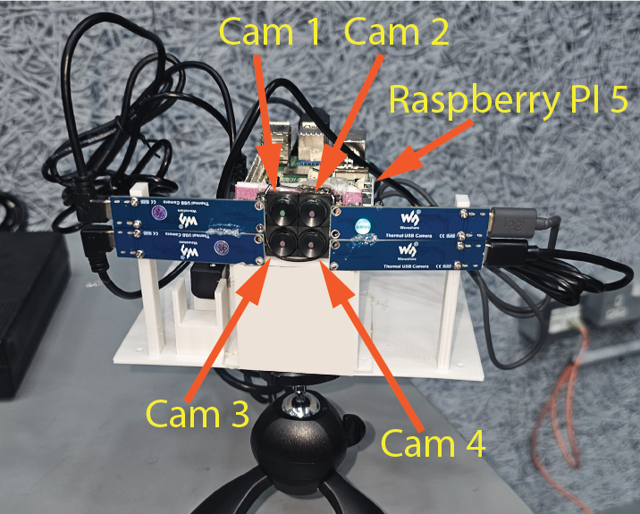
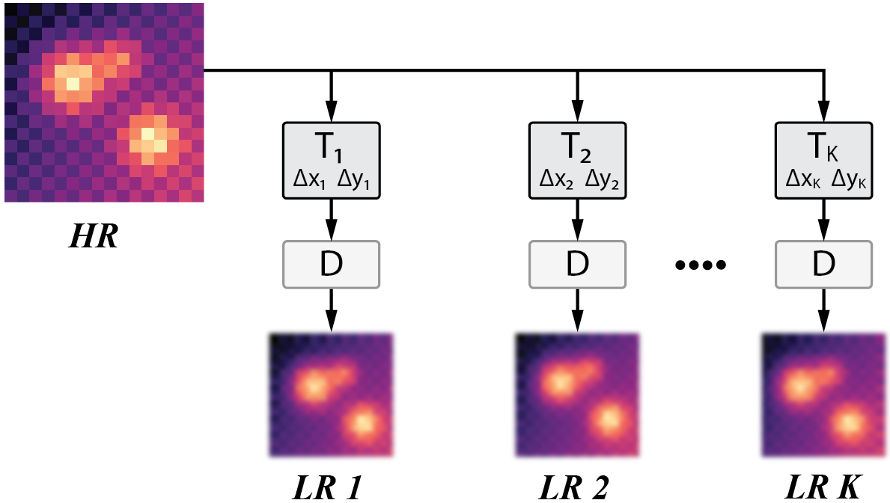
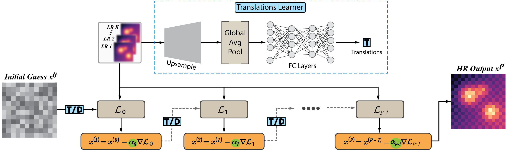
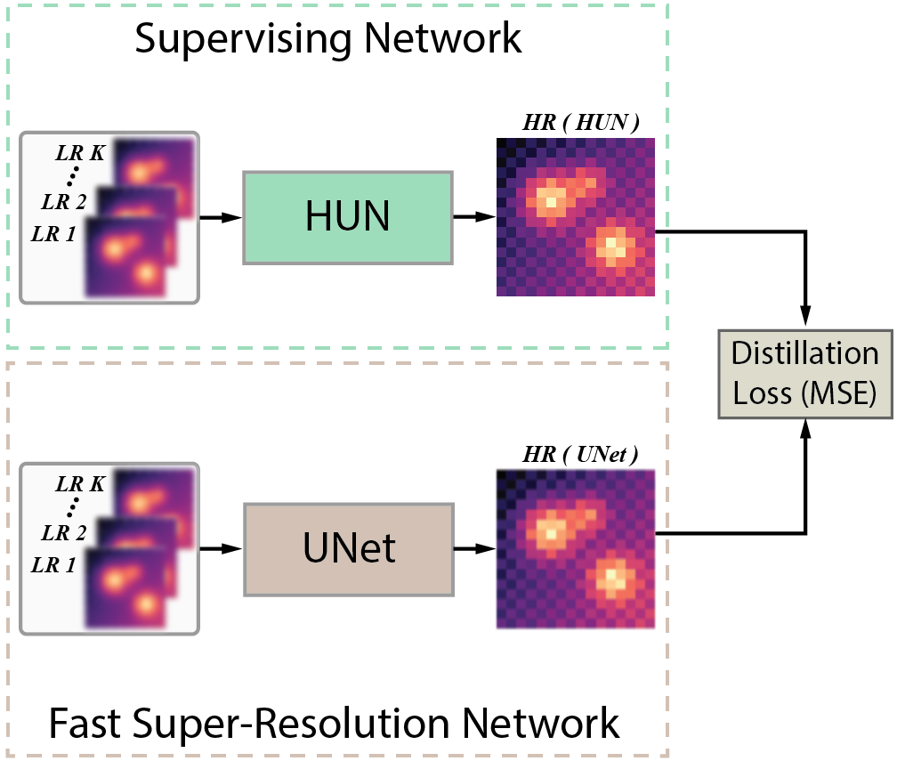
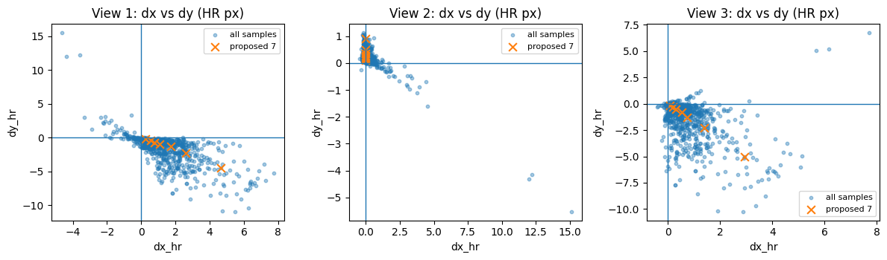
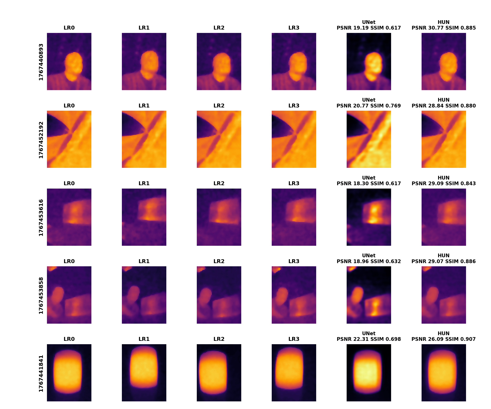

# HUNTS

## Distilling a Hybrid Unfolded Network for Fast Multi-Camera Thermal Super-Resolution

This repository implements the Hybrid Unfolded Network (HUN) and its
distilled UNet version for fast multi-camera thermal super-resolution.

------------------------------------------------------------------------

# Installation

After cloning the repository, install dependencies:

```bash
pip install -r requirements.txt
```

------------------------------------------------------------------------

# Repository Structure

```
fast-hunts/
│
├── dataset/                     # Multi-camera dataset root
│   └── 4c/                      # Each sample contains 4 LR images (LR0-LR3)
│
├── figures/                     # Paper figures
│   ├── 7_points.png             # Translation distribution and ablation
│   ├── final_grid.png           # Qualitative comparison results
│   ├── forward-01.png           # Multi-camera forward model
│   ├── setup-11.png             # Hardware acquisition rig
│   └── unfolded_neural_network_translations_learning-10.png  # HUN architecture
│
├── inference/                   # Saved inference outputs
│   ├── fold_1/                  # Fold 1 results
│   ├── fold_2/                  # Fold 2 results
│   ├── fold_3/                  # Fold 3 results
│   ├── fold_4/                  # Fold 4 results
│   └── fold_5/                  # Fold 5 results
│
├── infer_all_metrics.py         # Aggregates PSNR, SSIM and timing
├── unet_train.py                # Train distilled UNet (after HUN)
├── unet_infer.py                # UNet inference
├── unfolded_train.py            # Train Hybrid Unfolded Network
├── unfolded_infer.py            # HUN inference
├── requirements.txt             # Python dependencies
├── LICENSE.txt                  # MIT license
└── README.md
```

------------------------------------------------------------------------

# Hardware Setup



The acquisition rig consists of:

- 4 Waveshare Thermal-90 cameras  
- Raspberry Pi 5 controller  
- Rigid mounting platform with fixed baselines  

The cameras simultaneously capture slightly displaced low-resolution
thermal views of the same scene. Scene depth variation induces
image-dependent inter-camera translations.

------------------------------------------------------------------------

# Multi-Camera Forward Model



Each high-resolution image is translated by camera-specific
subpixel shifts and then downsampled to produce low-resolution
measurements:

$$
y_i = D(T_i(X))
$$

Where:

- $T_i$ - subpixel translation operator  
- $D$ - averaging downsampling operator  
- $X$ - latent high-resolution image  

This forward model enforces measurement consistency across all
multi-view observations.

------------------------------------------------------------------------

# Model Overview



The architecture contains two components.

## 1. Translation Learning Module

- CNN feature extractor  
- Global average pooling  
- Fully connected regression head  
- Predicts inter-camera translations  

$$
\tau = \{ (\Delta x_i, \Delta y_i) \}_{i=2}^{K}
$$

Translations are estimated per acquisition and reused across all
unfolded reconstruction steps.

## 2. Unfolded Gradient Descent Reconstruction

- $P$ refinement steps  
- Physics-based reprojection loss  
- Learnable step sizes  
- Shared translations reused across layers  

Final reconstruction:

$$
X_{\text{HUN}}
$$

------------------------------------------------------------------------

# Distilled UNet



After HUN training, a lightweight UNet is trained using HUN
reconstructions as supervision.

- Input - stacked 4 LR images  
- Output - HR reconstruction  
- Loss - mean squared error to HUN output  

The UNet provides fast single-pass inference while preserving
multi-view geometric consistency.

------------------------------------------------------------------------

# Translation Distribution and Ablation



The figure shows the distribution of learned translations across the
dataset. Seven fixed translation points are selected from the dominant
distribution direction to evaluate the impact of removing the
translation learning module.

------------------------------------------------------------------------

# Qualitative Results



Each row shows:

- LR0, LR1, LR2, LR3  
- UNet reconstruction  
- HUN reconstruction  
- PSNR and SSIM values  

HUN enforces stronger measurement consistency, while UNet preserves
structure with significantly reduced runtime.

------------------------------------------------------------------------

# Training and Inference

**Important:** HUN must be trained before training the UNet.

## Step: 1 - Train HUN

```bash
python unfolded_train.py
```

This trains the Hybrid Unfolded Network and generates the
reconstructions used for distillation.

## Step: 2 - Train UNet

```bash
python unet_train.py
```

The UNet learns to approximate HUN outputs.

## Inference

HUN inference:

```bash
python unfolded_infer.py
```

UNet inference:

```bash
python unet_infer.py
```

------------------------------------------------------------------------

# Citation

If you use this repository or dataset in your research, please cite the
conference paper:

```
@inproceedings{hunts2025sani,
  title     = {HUNTS: Distilling a Hybrid Unfolded Network for Fast Multi-Camera Thermal Super-Resolution},
  author    = {TBD},
  booktitle = {TBD Conference},
  year      = {2026}
}
```

------------------------------------------------------------------------

# License

This project is released under the MIT License.  